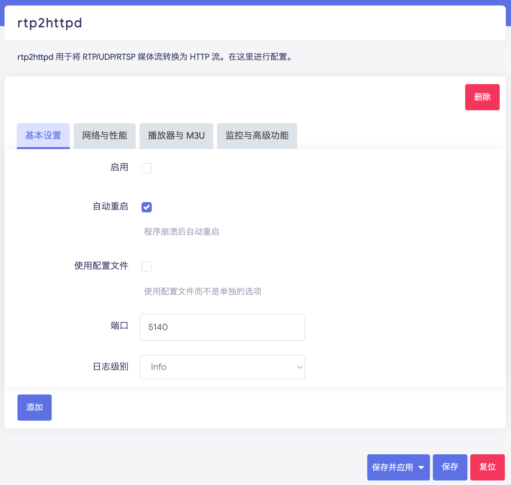

# Quick Start

## OpenWrt One-Click Install/Update (Recommended)

Run the following command to automatically download and install the latest version:

```bash
uclient-fetch -q -O - https://raw.githubusercontent.com/stackia/rtp2httpd/main/scripts/install-openwrt.sh | sh
```

The script will automatically:

- Detect your device's CPU architecture
- Fetch the latest version from GitHub Release
- Download and install all necessary packages (main program + LuCI interface + language pack)
- If previously installed, running this script will uninstall the old version and reinstall the latest version

> [!TIP]
> If the one-click script doesn't work, you can manually download the packages for your architecture from the [Releases](https://github.com/stackia/rtp2httpd/releases) page:
>
> - `rtp2httpd_<version>_<arch>.ipk` - Main program package
> - `luci-app-rtp2httpd_<version>_all.ipk` - LuCI Web interface
> - `luci-i18n-rtp2httpd-zh-cn_<version>_all.ipk` - Chinese language pack
>
> ```bash
> # If you don't know your architecture, use this command to get it
> cat /etc/openwrt_release | grep ARCH
>
> # Manually upload ipk files to device and install
> opkg install rtp2httpd_*.ipk luci-app-rtp2httpd_*.ipk luci-i18n-rtp2httpd-*.ipk
> ```

## Basic Configuration

After installation, find "rtp2httpd" in the "Services" menu of the LuCI management interface to configure:



> [!WARNING]
> After each version update, if LuCI behaves abnormally, you need to **Ctrl+F5 refresh** or **clear browser cache** or **use incognito mode** to resolve.

> [!IMPORTANT]
> If rtp2httpd entry does not appear in LuCI after installation, it means your LuCI version is too old to support JS-based LuCI plugins. Please consider updating your firmware, or manually edit and maintain `/etc/config/rtp2httpd` (set disabled to 0), and use `/etc/init.d/rtp2httpd restart` to restart the service.
>
> Some community members have developed Lua-based luci-app-rtp2httpd, which you can try in this case (not officially maintained by rtp2httpd)
>
> - <https://www.right.com.cn/forum/thread-8461513-1-1.html>
> - <https://github.com/jarod360/rtp2httpd/releases>


### Required Configuration Items

1. **Basic Settings - Enable**: Check to enable rtp2httpd
2. **Basic Settings - Port**: Default 5140, or customize
3. **Network & Performance - Upstream Interface**: Set to IPTV network interface

### Optional Configuration Items

- **Player & M3U - External M3U**: If you have an existing M3U playlist, fill in this setting to use the [Built-in Web Player](/en/guide/web-player) ([M3U Playlist Integration](/en/guide/m3u-integration))
- **FCC Server**: For fast channel change, you need to include the FCC server address in the program URL ([FCC Fast Channel Change Setup](/en/guide/fcc-setup))

## Test Access

After configuration, you can test access with the following URLs:

```bash
# Access RTP multicast stream
http://router-IP:5140/rtp/239.253.64.120:5140

# Access status page
http://router-IP:5140/status

# Get M3U playlist (if configured)
http://router-IP:5140/playlist.m3u
```

## Use Built-in Player

If M3U playlist is configured, you can directly access `http://router-IP:5140/player` in your browser to open the [Built-in Web Player](/en/guide/web-player).

## Use in Other Players

Add `http://router-IP:5140/playlist.m3u` to any IPTV-compatible player to watch.

## View Logs

There are three ways to view runtime logs:

1. Visit the status page `/status`, view logs at the bottom of the page
2. In OpenWrt backend, "Status" -> "System Log" to view logs
3. SSH connect to router and run `logread -e rtp2httpd`

## Next Steps

- [Built-in Web Player](/en/guide/web-player): Player features and compatibility notes
- [Installation Methods](/en/guide/installation): Learn about other installation methods (Docker, static binary, compile from source)
- [M3U Playlist Integration](/en/guide/m3u-integration): Configure playlist auto-recognition and conversion
- [URL Format Guide](/en/guide/url-formats): Learn all supported URL formats
- [Configuration Reference](/en/reference/configuration): In-depth understanding of all configuration options
- [FCC Fast Channel Change Setup](/en/guide/fcc-setup): Enable millisecond-level channel switching
