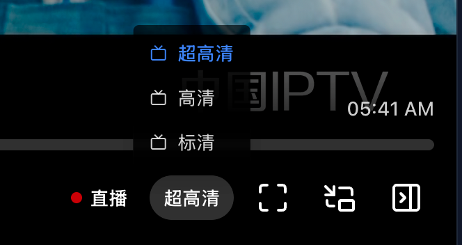

# Built-in Web Player

rtp2httpd includes a modern web-based player that allows you to watch configured M3U channel lists directly in your browser without installing any client software.

## Access

After configuring M3U playlists, access the player via your browser:

```url
http://server:port/player
```

**Example**:

```url
http://192.168.1.1:5140/player
```

The player page path can be customized via the `player-page-path` configuration option. Setting it to `/` enables direct access without any path.

## Features

- **Channel List**: Automatically loads configured M3U channel lists
- **Live Streaming**: Watch live broadcasts directly in the browser
- **Time-Shifted Playback**: Supports EPG (Electronic Program Guide) and time-shifted playback (requires catchup source)
- **Fast Startup**: Achieves millisecond-level channel switching with FCC
- **Responsive Design**: UI adapts to both desktop and mobile devices
- **PWA Support**: Can be added to the home screen on phones, tablets, desktops, or LG webOS TVs for app-like quick access
- **Zero Overhead**: Pure web frontend implementation with virtually no resource overhead on rtp2httpd (no decoding/transcoding overhead)

> [!IMPORTANT]
> The player relies on the browser's native decoding capabilities. Some encoding formats (such as E-AC3) may not play in certain browsers (manifested as no audio or black screen). We recommend using the latest versions of Chrome, Edge, or Safari.

## MP2 Audio Software Decoding

Most IPTV HD and SD channels use MPEG-1 Layer 2 (MP2) audio encoding. Some browsers (such as iOS Safari) do not natively support MP2 decoding, causing programs to fail to play or play with video only (no audio).

The player has built-in MP2 audio software decoding capability:

- **iOS Safari**: Enabled by default. Testing shows most programs can now play normally.
- **Other browsers**: Disabled by default. You can manually enable the "MP2 Audio Software Decoding" option by clicking the sidebar settings button.

> [!NOTE]
> Audio software decoding relies on browser Web Workers and WebAssembly for background decoding, which consumes some computational resources and may cause slight heating on mobile devices — this is normal. Additionally, due to browser limitations, background playback on mobile devices is not supported when using software decoding.

## PWA Support and Add to Home Screen

The built-in web player supports PWA (Progressive Web App). You can add the player page to your device's home screen (including phones, tablets, computers, and LG webOS smart TVs) and launch it like a native app for a full-screen, immersive viewing experience.

After adding to the home screen, the desktop icon is named **IPTV** by default and uses the built-in app icon. The player retains local settings such as theme preferences.

### iOS / iPadOS (Safari)

1. Open the player page in Safari (for example, `http://192.168.1.1:5140/player`)
2. Tap **Share** in the extensions menu on the left side of the address bar
3. Scroll down in the share menu and select **Add to Home Screen**
4. Confirm the name and tap **Add**

### Android (Chrome, Edge, etc.)

1. Open the player page in your browser
2. Tap the **Menu** button (⋮) in the top-right corner
3. Select **Add to Home screen** or **Install app**
4. Confirm when prompted

Some browsers also show an install banner in the address bar or at the bottom of the page. Tap **Install** or **Add** to complete the process.

### Desktop (Chrome, Edge)

1. Open the player page in your browser
2. Click the **Install** icon in the address bar (if available), or choose **Cast, save, and share** → **Create shortcut** from the browser menu
3. Confirm when prompted

Once installed, the player runs in a standalone window and can be launched quickly from the system app list, Dock, or taskbar.

### LG TV (webOS)

LG webOS smart TVs can also use the built-in browser to open the player and pin it to the TV home screen:

1. Open the **Web Browser** app on your TV
2. Enter the player page URL in the address bar (for example, `http://192.168.1.1:5140/player`)
3. Open the browser menu and select **Add shortcut to the Home screen**
4. Return to the TV home screen and launch the player from the shortcut

> [!NOTE]
> If you customized the player path via `player-page-path`, use the actual path when adding to the home screen. The shortcut is pinned to the URL used at the time of adding, including query parameters such as `r2h-token` (if present).

## Channel Aggregation

When multiple channels with the **same group and same name** exist in the M3U, the player automatically aggregates them into multiple sources of one channel, displaying them only once in the channel list. Users can switch between different sources (such as different quality levels) using the source selector:



If a source URL has a `$label` suffix, the player extracts it as the source's display label (such as "UHD", "HD", "SD"). Sources without `$label` are displayed with sequential numbers (such as "Source 1", "Source 2").

> [!NOTE]
> Channel aggregation is a frontend feature of the **built-in web player**, not a server-side behavior of rtp2httpd. Whether third-party players (such as APTV, TiviMate, etc.) support similar aggregated display depends on their own implementation. The rtp2httpd server only parses `$label`, generates independent service paths, and preserves `$label` in the converted M3U.

For M3U configuration of source labels, see [M3U Playlist Integration](/en/guide/m3u-integration#source-labels).

## Time Placeholders

The built-in web player supports the following time placeholder formats, which can be used in M3U `catchup-source` URLs:

### `${}` Format (uses long format)

| Placeholder                   | Description                                           | Example Output           |
| ----------------------------- | ----------------------------------------------------- | ------------------------ |
| `${utc}`                      | Program start time (UTC, ISO8601 format)              | 2025-01-15T10:30:45.000Z |
| `${utc:yyyyMMddHHmmss}`       | Program start time (UTC, custom long format)          | 20250115103045           |
| `${utcend}`                   | Program end time (UTC, ISO8601 format)                | 2025-01-15T12:30:45.000Z |
| `${utcend:yyyyMMddHHmmss}`    | Program end time (UTC, custom long format)            | 20250115123045           |
| `${start}`                    | Same as `${utc}`                                      | 2025-01-15T10:30:45.000Z |
| `${start:yyyyMMddHHmmss}`     | Same as `${utc:yyyyMMddHHmmss}`                       | 20250115103045           |
| `${end}`                      | Same as `${utcend}`                                   | 2025-01-15T12:30:45.000Z |
| `${end:yyyyMMddHHmmss}`       | Same as `${utcend:yyyyMMddHHmmss}`                    | 20250115123045           |
| `${lutc}`                     | Current time (UTC, ISO8601 format)                    | 2025-01-15T14:00:00.000Z |
| `${lutc:yyyyMMddHHmmss}`      | Current time (UTC, custom long format)                | 20250115140000           |
| `${now}`                      | Same as `${lutc}`                                     | 2025-01-15T14:00:00.000Z |
| `${now:yyyyMMddHHmmss}`       | Same as `${lutc:yyyyMMddHHmmss}`                      | 20250115140000           |
| `${timestamp}`                | Current Unix timestamp (seconds)                      | 1736949600               |
| `${timestamp:yyyyMMddHHmmss}` | Same as `${lutc:yyyyMMddHHmmss}`                      | 20250115140000           |
| `${(b)yyyyMMddHHmmss}`        | Program start time (local time, long format)          | 20250115183045           |
| `${(e)yyyyMMddHHmmss}`        | Program end time (local time, long format)            | 20250115203045           |
| `${(b)yyyyMMdd\|UTC}`         | Program start time (UTC, long format)                 | 20250115103045           |
| `${(e)yyyyMMdd\|UTC}`         | Program end time (UTC, long format)                   | 20250115123045           |
| `${(b)timestamp}`             | Program start time Unix timestamp (seconds)           | 1736937045               |
| `${(e)timestamp}`             | Program end time Unix timestamp (seconds)             | 1736944245               |
| `${yyyy}`                     | Program start time: 4-digit year (local time)         | 2025                     |
| `${MM}`                       | Program start time: month 01-12 (local time)          | 01                       |
| `${dd}`                       | Program start time: day 01-31 (local time)            | 15                       |
| `${HH}`                       | Program start time: hour 00-23 (local time)           | 18                       |
| `${mm}`                       | Program start time: minute 00-59 (local time)         | 30                       |
| `${ss}`                       | Program start time: second 00-59 (local time)         | 45                       |
| `${duration}`                 | Program duration (seconds)                            | 7200                     |
| `${offset}`                   | Seconds elapsed since program start                   | 12600                    |

### `{}` Format (uses short format)

| Placeholder              | Description                                            | Example Output           |
| ------------------------ | ------------------------------------------------------ | ------------------------ |
| `{utc}`                  | Program start time (UTC, ISO8601 format)               | 2025-01-15T10:30:45.000Z |
| `{utc:YmdHMS}`           | Program start time (UTC, custom short format)          | 20250115103045           |
| `{utcend}`               | Program end time (UTC, ISO8601 format)                 | 2025-01-15T12:30:45.000Z |
| `{utcend:YmdHMS}`        | Program end time (UTC, custom short format)            | 20250115123045           |
| `{start}`                | Same as `{utc}`                                        | 2025-01-15T10:30:45.000Z |
| `{start:YmdHMS}`         | Same as `{utc:YmdHMS}`                                 | 20250115103045           |
| `{end}`                  | Same as `{utcend}`                                     | 2025-01-15T12:30:45.000Z |
| `{end:YmdHMS}`           | Same as `{utcend:YmdHMS}`                              | 20250115123045           |
| `{lutc}`                 | Current time (UTC, ISO8601 format)                     | 2025-01-15T14:00:00.000Z |
| `{lutc:YmdHMS}`          | Current time (UTC, custom short format)                | 20250115140000           |
| `{now}`                  | Same as `{lutc}`                                       | 2025-01-15T14:00:00.000Z |
| `{now:YmdHMS}`           | Same as `{lutc:YmdHMS}`                                | 20250115140000           |
| `{timestamp}`            | Current Unix timestamp (seconds)                       | 1736949600               |
| `{timestamp:YmdHMS}`     | Same as `{lutc:YmdHMS}`                                | 20250115140000           |
| `{(b)YmdHMS}`            | Program start time (local time, short format)          | 20250115183045           |
| `{(e)YmdHMS}`            | Program end time (local time, short format)            | 20250115203045           |
| `{(b)YmdHMS\|UTC}`       | Program start time (UTC, short format)                 | 20250115103045           |
| `{(e)YmdHMS\|UTC}`       | Program end time (UTC, short format)                   | 20250115123045           |
| `{(b)timestamp}`         | Program start time Unix timestamp (seconds)            | 1736937045               |
| `{(e)timestamp}`         | Program end time Unix timestamp (seconds)              | 1736944245               |
| `{Y}`                    | Program start time: 4-digit year (local time)          | 2025                     |
| `{m}`                    | Program start time: month 01-12 (local time)           | 01                       |
| `{d}`                    | Program start time: day 01-31 (local time)             | 15                       |
| `{H}`                    | Program start time: hour 00-23 (local time)            | 18                       |
| `{M}`                    | Program start time: minute 00-59 (local time)          | 30                       |
| `{S}`                    | Program start time: second 00-59 (local time)          | 45                       |
| `{duration}`             | Program duration (seconds)                             | 7200                     |
| `{offset}`               | Seconds elapsed since program start                    | 12600                    |

### Format Description

**Long Format**: Used for custom formats in `${}` brackets

- `yyyy` - 4-digit year
- `MM` - 2-digit month (01-12)
- `dd` - 2-digit day (01-31)
- `HH` - 2-digit hour (00-23)
- `mm` - 2-digit minute (00-59)
- `ss` - 2-digit second (00-59)

Example: `${utc:yyyyMMddHHmmss}` → `20250115103045`

**Short Format**: Used for custom formats in `{}` brackets

- `Y` - 4-digit year
- `m` - 2-digit month (01-12)
- `d` - 2-digit day (01-31)
- `H` - 2-digit hour (00-23)
- `M` - 2-digit minute (00-59)
- `S` - 2-digit second (00-59)

Example: `{utc:YmdHMS}` → `20250115103045`

## Related Documentation

- [M3U Playlist Integration](/en/guide/m3u-integration): M3U configuration and source labels
- [FCC Fast Channel Change Setup](/en/guide/fcc-setup): Enable millisecond-level channel switching
- [Configuration Reference](/en/reference/configuration): Player-related configuration parameters
