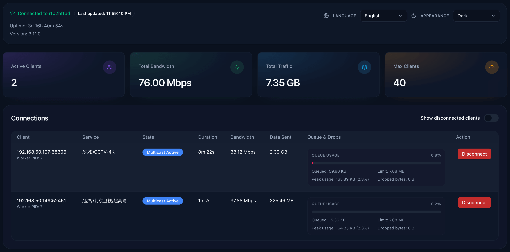

## Demos

### Fast Channel Change + Time-Shift Playback

<video controls muted src="https://github.com/user-attachments/assets/ca1a332f-d6e7-4a1e-be88-92bef67758b3" />

> [!TIP]
> Fast channel change requires using IPTV-optimized players, such as [mytv-android](https://github.com/mytv-android/mytv-android) / [TiviMate](https://tivimate.com) / [Cloud Stream](https://apps.apple.com/us/app/cloud-stream-iptv-player/id1138002135) / built-in web player. The player in the video is TiviMate.
>
> Some common general-purpose players (such as PotPlayer / IINA) are not optimized for startup speed and will not show significant improvement.

### Built-in Web Player

<video controls muted src="https://github.com/user-attachments/assets/b32f134d-87ac-46d0-90fe-50ffa410069a" />

> [!TIP]
> Requires M3U playlist configuration. Access via browser at `http://<server:port>/player` to open.
>
> Due to browser decoding limitations, some channels may not be supported (manifested as no audio or black screen).

### Real-time Status Monitoring

### 25 Concurrent 1080p Multicast Streams

<video controls muted src="https://github.com/user-attachments/assets/9d531ab6-6c35-4c50-802a-71f88b6b22c5" />

> [!NOTE]
> Single stream bitrate 8 Mbps. Total CPU usage only 25% of a single core (i3-N305), 4MB memory.
>
> For comparison with udpxy / msd_lite / tvgate, see the [Performance Benchmark](./reference/benchmark.md).

