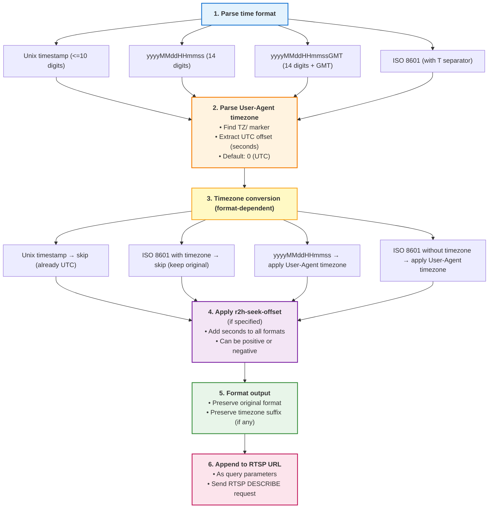

# RTSP Time Handling and Timezone Conversion

Language: [中文](../rtsp-time-processing.md) | [English](rtsp-time-processing.md)

This document explains how rtp2httpd handles time parameters and timezone conversion for RTSP catchup playback.

## IPTV RTSP Catchup Basics

IPTV RTSP servers usually support catchup playback, allowing users to watch earlier segments. This is done by adding time range parameters (e.g., `playseek`, `tvdr`) to the RTSP URL.

**Basic flow**:

1. **Client request**: The client requests a specific time range.

   ```
   rtsp://iptv.example.com:554/channel1?playseek=20240101120000-20240101130000
   ```

2. **Server response**: The RTSP server returns recorded content for that range.

3. **Time format requirements**: Different operators expect different formats and timezones. Some require UTC, some GMT+8, some expect `20240101120000`, others expect `20240101120000GMT`. Player support varies. If the player format/timezone does not match the operator, catchup fails.

## What rtp2httpd Does

As a proxy, rtp2httpd can flexibly convert time formats and timezones to match what the operator expects.

**Key features**:

- Auto-detects multiple time formats (Unix timestamp, yyyyMMddHHmmss, ISO 8601, etc.)
- Parses client timezone from User-Agent
- Smart timezone conversion (only for formats that need it)
- Supports extra time offsets (clock drift compensation)
- Keeps output format consistent with input format

## Seek Parameter Configuration

### r2h-seek-name (optional)

Specify the RTSP seek parameter name. If not set, rtp2httpd auto-detects common names.

#### Auto-detected names (priority order)

1. `playseek` - most common
2. `tvdr` - used by some IPTV systems

#### Usage

- **Standard names**: If the RTSP server uses `playseek` or `tvdr`, no need to set this
- **Custom names**: If the server uses another name (e.g., `seek`, `timeshift`), set `r2h-seek-name`

#### Examples

```url
# Auto-detect playseek
http://192.168.1.1:5140/rtsp/iptv.example.com:554/channel1?playseek=20240101120000-20240101130000

# Auto-detect tvdr
http://192.168.1.1:5140/rtsp/iptv.example.com:554/channel1?tvdr=20240101120000-20240101130000

# Custom param name
http://192.168.1.1:5140/rtsp/iptv.example.com:554/channel1?custom_seek=20240101120000&r2h-seek-name=custom_seek
```

### r2h-seek-offset (optional)

Extra offset in seconds applied when a seek parameter is found. Can be positive or negative.

#### Use cases

- **Clock drift compensation**: RTSP server time is consistently off
- **Fine tuning**: Start a few seconds earlier or later
- **Testing and debugging**: Validate different time positions

#### Examples

```url
# Add 1 hour (3600 seconds) to the playseek range
http://192.168.1.1:5140/rtsp/iptv.example.com:554/channel1?playseek=20240101120000-20240101130000&r2h-seek-offset=3600

# Subtract 30 seconds from the playseek range
http://192.168.1.1:5140/rtsp/iptv.example.com:554/channel1?playseek=20240101120000-20240101130000&r2h-seek-offset=-30
```

### r2h-start (optional)

Start playback from a specific time point for resume playback. This value is sent as an NPT (Normal Play Time) in the RTSP PLAY request header `Range: npt=<time>-`.

#### Example

```url
http://192.168.1.1:5140/rtsp/iptv.example.com:554/channel1?r2h-start=123.45
```

## Supported Time Formats

rtp2httpd can parse these formats. Timezone conversion and r2h-seek-offset only apply when parsing succeeds.

### 1. yyyyMMddHHmmss (14 digits)

```
playseek=20240101120000-20240101130000
```

### 2. Unix timestamp (<= 10 digits)

```
playseek=1704096000-1704099600
```

### 3. yyyyMMddHHmmssGMT (14 digits + GMT)

```
playseek=20240101120000GMT-20240101130000GMT
```

### 4. ISO 8601 (with T separator)

Multiple ISO 8601 variants are supported:

```
# No timezone (uses User-Agent timezone)
playseek=2024-01-01T12:00:00-2024-01-01T13:00:00

# Z suffix (UTC, no conversion)
playseek=2024-01-01T12:00:00Z-2024-01-01T13:00:00Z

# With timezone offset (kept as-is)
playseek=2024-01-01T12:00:00+08:00-2024-01-01T13:00:00+08:00

# With milliseconds
playseek=2024-01-01T12:00:00.123-2024-01-01T13:00:00.456
```

**Notes**:

- If timezone info is present (Z or ±HH:MM), it is used and User-Agent timezone is ignored
- If timezone info is missing, User-Agent timezone is used for conversion
- Output preserves the original timezone suffix (Z, ±HH:MM, or none)
- Millisecond precision (.sss) is supported

## Timezone Handling

### Timezone Detection

The server parses the `TZ/` marker from the User-Agent to get the client timezone:

#### Supported formats

- `TZ/UTC+8` - UTC offset
- `TZ/UTC-5` - UTC offset
- `TZ/UTC` - UTC

#### Default behavior

If the User-Agent has no timezone info, no timezone conversion is performed; only `r2h-seek-offset` is applied.

### Timezone Conversion Flow

rtp2httpd processes time parameters in the following steps:



## Related Docs

- [URL Formats](url-formats.md) - RTSP URL format
- [Configuration Reference](configuration.md) - Server configuration options
