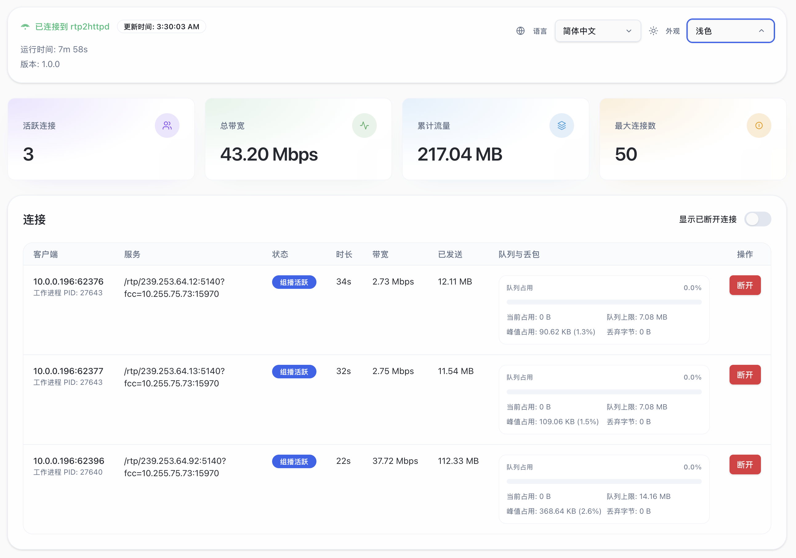

## 效果演示

### 快速换台 + 时移回看

<video controls preload="metadata" src="/videos/fcc-demo.mp4#t=0.001" />

> [!TIP]
> 快速换台需要搭配使用针对 IPTV 优化的播放器，例如 [mytv-android](https://github.com/mytv-android/mytv-android) / [TiviMate](https://tivimate.com) / [Cloud Stream](https://apps.apple.com/us/app/cloud-stream-iptv-player/id1138002135) / 内置 Web 播放器等。视频中的播放器是 TiviMate。
>
> 一些常见的万能播放器（如 PotPlayer / IINA）没有针对起播速度做优化，不会有明显效果。

### 内置 Web 播放器

<video controls preload="metadata" src="/videos/player-demo.mp4#t=0.001" />

> [!TIP]
> 需要配置 M3U 播放列表后使用，通过浏览器访问 `http://<server:port>/player` 即可打开。
>
> 受限于浏览器解码能力，一些频道可能不支持（表现为无音频、画面黑屏）。

### 实时状态监控

### 25 条 1080p 组播流同时播放

<video controls preload="metadata" src="/videos/multistream-demo.mp4#t=0.001" />

> [!NOTE]
> 单流码率 8 Mbps。总仅占用 25% CPU 单核 (i3-N305)，消耗 4MB 内存。
>
> 与 udpxy / msd_lite / tvgate 的对比，详见 [性能测试报告](./reference/benchmark.md)。

