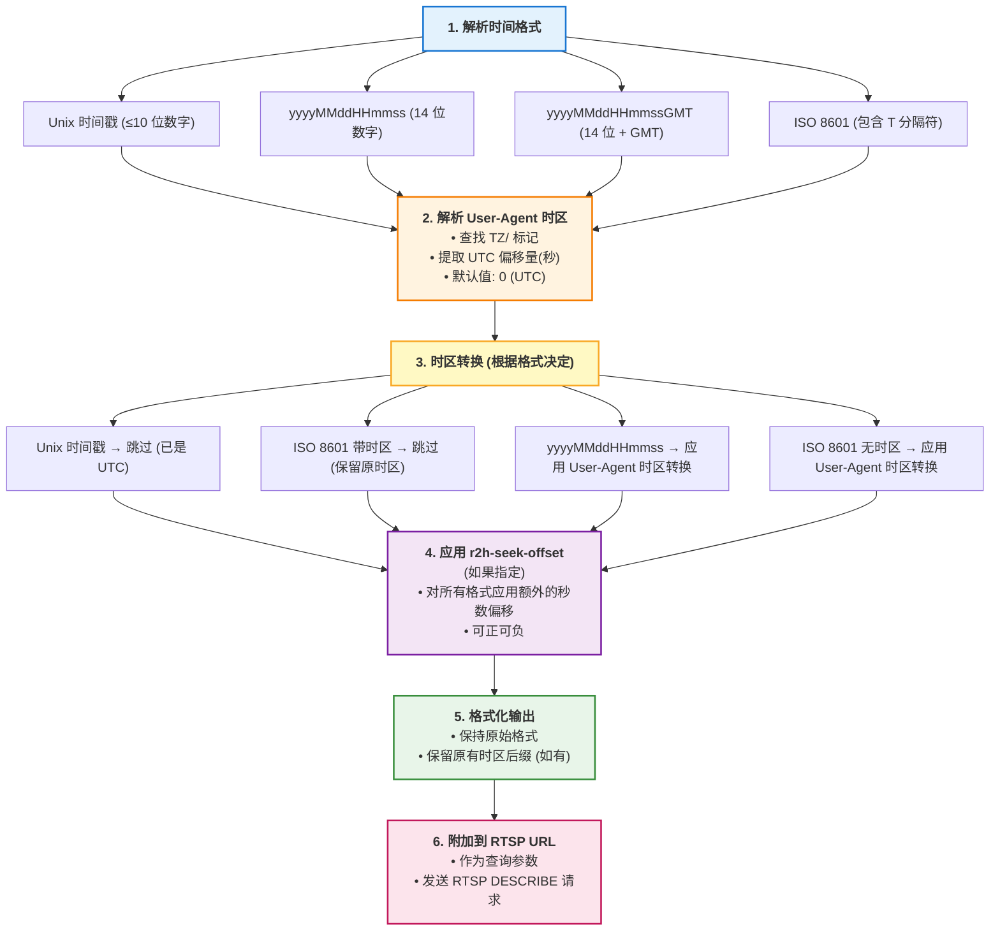

# RTSP 时间处理与时区转换

本文档详细说明 rtp2httpd 如何处理 RTSP 时移回看功能中的时间参数和时区转换。

## IPTV RTSP 时移回看原理

IPTV 运营商的 RTSP 服务器通常支持时移回看功能，允许用户观看过去时间段的直播内容。这个功能通过在 RTSP URL 中添加时间范围参数（如 `playseek`、`tvdr` 等）来实现。

**基本工作流程**：

1. **客户端请求**：客户端向 RTSP 服务器请求特定时间段的视频。

   ```
   rtsp://iptv.example.com:554/channel1?playseek=20240101120000-20240101130000
   ```

2. **服务器响应**：RTSP 服务器根据时间参数，从录制的历史内容中返回对应时间段的视频流

3. **时间格式要求**：各地区 IPTV 运营商要求时间格式和时区可能有不同，利用有些期望 UTC 时区，有些期望 GMT+8 时区，有些期望 `20240101120000` 这样的格式，有些期望 `20240101120000GMT` 这样的格式。各播放器对时区和时间格式的支持也五花八门。一旦播放器格式、时区和运营商不匹配，就会造成回看失败。

## rtp2httpd 的作用

rtp2httpd 作为中间代理，能够根据配置灵活转换时间格式和时区，把播放器发来的时间和运营商期望的时间进行匹配。

**核心特性**：

- 自动识别多种时间格式（Unix 时间戳、yyyyMMddHHmmss、ISO 8601 等）
- 从 User-Agent 头解析客户端时区信息
- 智能时区转换（仅对需要转换的格式）
- 支持额外的时间偏移量（补偿时钟偏差）
- 保持输出格式与输入格式一致

## Seek 参数配置

### r2h-seek-name 参数（可选）

用于指定 RTSP 时移参数的名称。如果不指定，rtp2httpd 会自动识别常见的参数名。

#### 自动识别的参数名（按优先级）

1. `playseek` - 最常见的时移参数
2. `tvdr` - 部分 IPTV 系统使用的参数名

#### 使用方法

- **标准参数名**：当 RTSP 服务器使用 `playseek` 或 `tvdr` 时，无需指定此参数
- **自定义参数名**：当 RTSP 服务器使用其他参数名（如 `seek`、`timeshift` 等）时，需要通过 `r2h-seek-name` 显式指定

#### 示例

```url
# 自动识别 playseek 参数
http://192.168.1.1:5140/rtsp/iptv.example.com:554/channel1?playseek=20240101120000-20240101130000

# 自动识别 tvdr 参数
http://192.168.1.1:5140/rtsp/iptv.example.com:554/channel1?tvdr=20240101120000-20240101130000

# 使用自定义参数名
http://192.168.1.1:5140/rtsp/iptv.example.com:554/channel1?custom_seek=20240101120000&r2h-seek-name=custom_seek
```

### r2h-seek-offset 参数（可选）

当识别到时移参数时，额外增加的秒数偏移量，可以是正数或负数。

#### 使用场景

- **补偿时钟偏差**：RTSP 服务器与实际时间存在固定偏差时
- **微调时移位置**：需要提前或延后若干秒开始播放时
- **测试与调试**：验证不同时间点的内容

#### 示例

```url
# 在 playseek 指定的范围上增加 1 小时（3600 秒）
http://192.168.1.1:5140/rtsp/iptv.example.com:554/channel1?playseek=20240101120000-20240101130000&r2h-seek-offset=3600

# 在 playseek 指定的范围上减少 30 秒
http://192.168.1.1:5140/rtsp/iptv.example.com:554/channel1?playseek=20240101120000-20240101130000&r2h-seek-offset=-30
```

## 支持的时间格式

rtp2httpd 支持解析以下时间格式。只有当时间能够被成功解析时，才可以进行时区转换或应用 r2h-seek-offset 秒数偏移。

### 1. yyyyMMddHHmmss 格式（14 位数字）

```
playseek=20240101120000-20240101130000
```

### 2. Unix 时间戳格式（10 位以内数字）

```
playseek=1704096000-1704099600
```

### 3. yyyyMMddHHmmssGMT 格式（14 位数字 + GMT 后缀）

```
playseek=20240101120000GMT-20240101130000GMT
```

### 4. ISO 8601 格式（包含 T 分隔符）

支持多种 ISO 8601 变体：

```
# 不带时区（使用 User-Agent 时区）
playseek=2024-01-01T12:00:00-2024-01-01T13:00:00

# 带 Z 后缀（UTC 时区，不做时区转换）
playseek=2024-01-01T12:00:00Z-2024-01-01T13:00:00Z

# 带时区偏移（保留原时区，不做时区转换）
playseek=2024-01-01T12:00:00+08:00-2024-01-01T13:00:00+08:00

# 带毫秒
playseek=2024-01-01T12:00:00.123-2024-01-01T13:00:00.456
```

**特点**：

- 如果包含时区信息（Z 或 ±HH:MM），使用该时区，忽略 User-Agent 时区
- 如果不包含时区信息，使用 User-Agent 中的时区进行转换
- 输出格式保持原有的时区后缀（Z、±HH:MM 或无后缀）
- 支持毫秒精度（.sss）

## 时区处理机制

### 时区识别

服务器会解析 User-Agent 中的 `TZ/` 标记来获取客户端时区信息：

#### 支持的时区格式

- `TZ/UTC+8` - UTC 偏移格式（东八区）
- `TZ/UTC-5` - UTC 偏移格式（西五区）
- `TZ/UTC` - 标准 UTC 时区

#### 默认行为

如果 User-Agent 中没有时区信息，则不进行任何时区转换，只应用 `r2h-seek-offset` 指定的秒数偏移。

### 时区转换工作流程

rtp2httpd 按以下步骤处理时间参数：



## 相关文档

- [URL 格式与协议支持](url-formats.md) - RTSP URL 格式说明
- [配置参数详解](configuration.md) - 服务器配置选项
